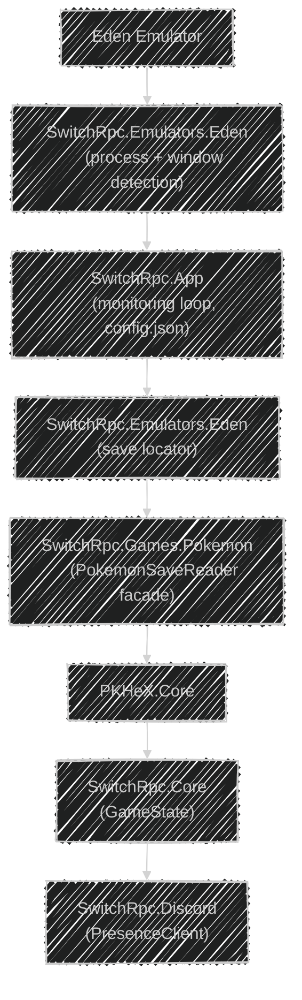

<p align="center">
    <br />
    
    
    
</p>

# SWITCH RPC

> Discord Rich Presence for Nintendo Switch games running through emulators.

SWITCH RPC is a modular Discord Rich Presence platform that detects
Nintendo Switch games running through emulators and exposes verified,
read-only game state to Discord.

The first fully implemented target is **Pokémon games running through
the Eden emulator**, with save data parsed through **PKHeX.Core**.
Support for additional emulators and non-Pokémon games is planned —
see [docs/ROADMAP.md](docs/ROADMAP.md).

A native **.NET 10 implementation** is the primary application, living
under `src/`; the retired Python baseline remains available in history
via the `v0.1.0-python-baseline` tag.

## 📑 Table of Contents

- [✨ Features](#-features)
- [🎮 Supported Games](#-supported-games)
- [🏗️ Architecture](#️-architecture)
- [📁 Project Structure](#-project-structure)
- [🔧 Requirements](#-requirements)
- [🚀 Installation](#-installation)
- [▶️ Usage](#️-usage)
- [🧪 Development Workflow](#-development-workflow)
- [💾 Save Data](#-save-data)
- [🧩 Save Reader](#-save-reader)
- [⚙️ Configuration](#️-configuration)
- [🧪 Testing](#-testing)
- [🗺️ Roadmap](#️-roadmap)
- [📚 Documentation](#-documentation)
- [🤝 Contributing](#-contributing)
- [⚖️ Third-Party Software](#️-third-party-software)
- [⚠️ Disclaimer](#️-disclaimer)
- [📄 License](#-license)

## ✨ Features

-   🎮 Automatically detect Pokémon games running through Eden
-   🎯 Identify the currently running game from the Eden window
-   💬 Discord Rich Presence integration
-   ⏱️ Session timer in Rich Presence
-   💾 Read Pokémon save data through PKHeX.Core
-   📖 Read Pokédex progress from supported save files
-   🕐 Read save playtime
-   📍 Read location data for supported save formats
-   🔒 Read-only save access --- save files are never modified
-   ⚙️ JSON-based configuration
-   🔌 Modular architecture for additional Pokémon games

## 🎮 Supported Games

Detection and save-reader support are tracked independently.

| Game | Eden Detection | Save Reader | Pokédex | Playtime |
|---|:---:|:---:|:---:|:---:|
| Pokémon Legends: Arceus | ✅ | ✅ | ✅ | ✅ |
| Pokémon Scarlet | ✅ | ✅ | ✅ | ✅ |
| Pokémon Violet | 🚧 | 🚧 | 🚧 | 🚧 |
| Pokémon Legends: Z-A | 🚧 | 🚧 | 🚧 | 🚧 |

Current verification means the save reader has been tested against an
actual supported local save. Detection alone does not mean that a game
is fully supported.

## 🏗️ Architecture

The runtime architecture is:



The solution enforces its boundaries physically: `SwitchRpc.Core` has no
dependencies, only `SwitchRpc.Games.Pokemon` touches PKHeX, and only
`SwitchRpc.Discord` touches the Discord library.

This flow is the first implementation of a broader adapter-based
architecture. The long-term target — emulator adapters, generic game
definitions, and pluggable save readers — is described in
[docs/ROADMAP.md](docs/ROADMAP.md).

## 📁 Project Structure

``` text
switch-rpc/
├── SwitchRpc.slnx                 # .NET 10 solution
├── config.json
├── CHANGELOG.md
├── CONTRIBUTING.md
├── LICENSE
├── .gitignore
│
├── src/                           # .NET 10 implementation
│   ├── SwitchRpc.App              # console host, monitoring loop
│   ├── SwitchRpc.Core             # GameState, game definitions
│   ├── SwitchRpc.Discord          # Discord Rich Presence wrapper
│   ├── SwitchRpc.Emulators.Eden   # Eden detection + save location
│   └── SwitchRpc.Games.Pokemon    # PKHeX save readers
│
├── tests/                         # .NET tests (xUnit)
│   └── SwitchRpc.Tests
│
├── assets/
│
├── bridge/
│   └── PKHeX/                     # Local PKHeX checkout, ignored by Git
│
└── docs/
    ├── ARCHITECTURE.md
    ├── BENCHMARKS.md
    ├── DEVELOPMENT.md
    ├── CONFIGURATION.md
    ├── SAVE-READER.md
    ├── DISCORD-RPC.md
    ├── GAME-SUPPORT.md
    ├── TROUBLESHOOTING.md
    ├── PKHeX.md
    └── ROADMAP.md
```

## 🔧 Requirements

### Software

-   Windows 11
-   .NET SDK 10+
-   Discord desktop application
-   Eden emulator
-   A supported Pokémon game

## 🚀 Installation

### 1. Clone the repository

``` powershell
git clone https://github.com/ramadhafidz/switch-rpc.git
cd switch-rpc
```

### 2. Set up PKHeX.Core

This project uses **PKHeX.Core** as an external dependency for Pokémon
save parsing.

PKHeX source is intentionally **not included in this repository**.

Expected local structure:

``` text
switch-rpc/
└── bridge/
    └── PKHeX/
        └── PKHeX.Core/
```

Obtain PKHeX separately and place its source at:

``` text
bridge/PKHeX/
```

Do not commit `bridge/PKHeX/`.

### 3. Build the solution

``` powershell
dotnet build SwitchRpc.slnx
```

### 4. Configure Discord

Create a Discord application and obtain its Application ID.

Configure the ID in `config.json`:

``` json
{
    "discord": {
        "client_id": "YOUR_DISCORD_APPLICATION_ID",
        "save_refresh_interval": 15,
        "pokedex_rotation_interval": 5
    }
}
```

See `docs/CONFIGURATION.md` for configuration details.

## ▶️ Usage

Start Discord first, then launch Eden and a supported Pokémon game.

Run:

``` powershell
dotnet run --project src/SwitchRpc.App
```

The application will:

1.  Detect the Eden process.
2.  Detect the currently running Pokémon game.
3.  Locate the game's save file.
4.  Read supported save data.
5.  Build the current `GameState`.
6.  Update Discord Rich Presence.
7.  Clear Rich Presence when the game closes.

The session timer remains active while the current game session is
represented in Discord.

## 🧪 Development Workflow

The development quality checks are:

``` powershell
dotnet build SwitchRpc.slnx
dotnet test SwitchRpc.slnx
```

A `--diagnose` mode runs the whole pipeline once without Eden or Discord
and prints the pipeline metrics:

``` powershell
dotnet run --project src/SwitchRpc.App --no-build -- --diagnose
```

## 💾 Save Data

Save files are accessed in read-only mode.

The project does not:

-   Modify save files.
-   Write Pokémon data.
-   Inject data into the game.
-   Bypass Nintendo online services.
-   Modify emulator security mechanisms.
-   Upload save data to external services.

Save parsing is performed locally through PKHeX.Core.

The project intentionally avoids manually guessing save offsets.
Game-specific structures must be based on verified PKHeX implementations
or other reliable technical information.

## 🧩 Save Reader

Save readers identify supported save formats through PKHeX:

``` text
SaveUtil.GetSaveFile()
        │
        ├── SAV8LA
        │     └── Pokémon Legends: Arceus
        │
        └── SAV9SV
              └── Pokémon Scarlet / Violet
```

All PKHeX interaction lives inside `SwitchRpc.Games.Pokemon`, behind the
`PokemonSaveReader` facade; the rest of the application only ever sees
the normalized `GameState`.

For Scarlet/Violet, the current reader exposes:

``` text
Playtime
Pokédex (Paldea, Kitakami, Blueberry)
Location
```

For Legends: Arceus, it exposes playtime and the Hisui Pokédex.

The human-readable location name is resolved using PKHeX's game
string/location data rather than a project-specific hardcoded location
dictionary.

## ⚙️ Configuration

Game-specific Rich Presence settings are stored in `config.json`.

Example:

``` json
{
    "discord": {
        "client_id": "YOUR_DISCORD_APPLICATION_ID",
        "save_refresh_interval": 15,
        "pokedex_rotation_interval": 5
    },
    "games": {
        "pokemon_scarlet": {
            "name": "Pokémon Scarlet",
            "region": "Paldea",
            "large_image": "scarlet",
            "large_text": "Pokémon Scarlet"
        }
    }
}
```

Each game can define:

-   Display name.
-   Region.
-   Discord artwork.
-   Artwork tooltip.

Update intervals are configurable in the `discord` section.

## 🧪 Testing

Automated tests are run with:

``` powershell
dotnet test SwitchRpc.slnx
```

The xUnit suite in `tests/SwitchRpc.Tests` covers:

- Presence formatting (Pokédex pages).
- The Scarlet/Violet and Legends: Arceus save readers against blank
  PKHeX-generated saves.
- The `PokemonSaveReader` facade (unidentifiable and unsupported files).
- The Eden save locator with an injected save root.

Integration testing runs the application itself with Eden and Discord
(`dotnet run --project src/SwitchRpc.App`) and verifies detection,
presence rotation, and cleanup on close.

The `--diagnose` mode exercises the whole save pipeline against real
local saves without requiring Eden or Discord:

``` powershell
dotnet run --project src/SwitchRpc.App --no-build -- --diagnose
```

Do not commit real save files to the repository.

## 🗺️ Roadmap

The detailed roadmap is maintained in:

``` text
docs/ROADMAP.md
```

The project evolves through explicit phases:

``` text
Phase 0   Python Baseline Stabilization    ✅ Complete
Phase 1   .NET 10 Architecture POC         ✅ Complete
Phase 2   Migrate RPC Core to .NET 10      ✅ Complete
Phase 3+  Universal Platform Evolution     ⏳ Planned
```

Everything described in this README (Eden detection, Pokémon save
reading, Discord RPC) belongs to the Phase 0 baseline. The .NET
migration, emulator and game adapters, API, and web clients are
planned phases, not implemented features.

See `docs/ROADMAP.md` for the full phase breakdown and guiding
principles.

## 📚 Documentation

-   [Architecture](docs/ARCHITECTURE.md)
-   [Development Setup](docs/DEVELOPMENT.md)
-   [Configuration](docs/CONFIGURATION.md)
-   [Save Reader](docs/SAVE-READER.md)
-   [Game Support](docs/GAME-SUPPORT.md)
-   [Discord RPC](docs/DISCORD-RPC.md)
-   [Troubleshooting](docs/TROUBLESHOOTING.md)
-   [PKHeX](docs/PKHeX.md)
-   [Roadmap](docs/ROADMAP.md)

Documentation should reflect the actual implementation status. Planned
features should not be presented as completed.

## 🤝 Contributing

Your help is most welcome regardless of form! Whether you want to report a bug, suggest a new feature, or write code, we'd love to have your input.

Check out the [CONTRIBUTING.md](CONTRIBUTING.md) file for our full guidelines. 

**Important Rules to Keep in Mind:**
- 🔒 **Read-only access:** We strictly do not modify user save files.
- 🚫 **No guessing:** Save structures and offsets must be verified against PKHeX or official docs.
- 💾 **No save files in Git:** Never commit personal `.sav` or `.bin` files.

If you're ready to contribute, feel free to open an Issue or submit a Pull Request!

## ⚖️ Third-Party Software

### PKHeX

PKHeX is used for Pokémon save file parsing.

PKHeX is developed by the PKHeX contributors and is licensed under the
GNU General Public License v3.0.

PKHeX source is not included in this repository and must be obtained
separately.

### DiscordRichPresence

Used for Discord Rich Presence communication.

See the DiscordRichPresence project for its license and terms.

### Eden Emulator

Used as the Nintendo Switch emulator whose process and window are
detected by this application.

This project is not affiliated with or endorsed by Eden or The Pokémon
Company.

## ⚠️ Disclaimer

Pokémon and related names, characters, and assets are trademarks of
their respective owners.

This project is a fan-made, independent software project and is not
affiliated with, endorsed by, or sponsored by:

-   Nintendo
-   The Pokémon Company
-   Game Freak
-   Eden

Use of this project is at your own discretion.

## 📄 License

The licensing terms for this project are currently being determined.

Third-party dependencies retain their respective licenses.
