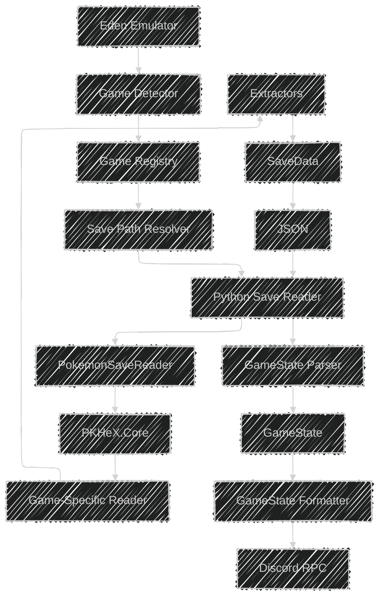
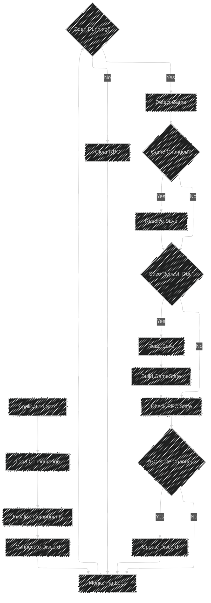
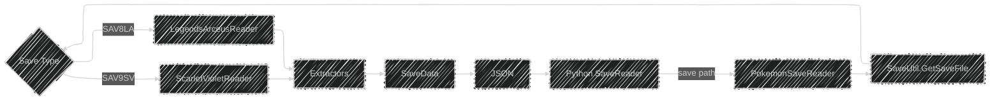
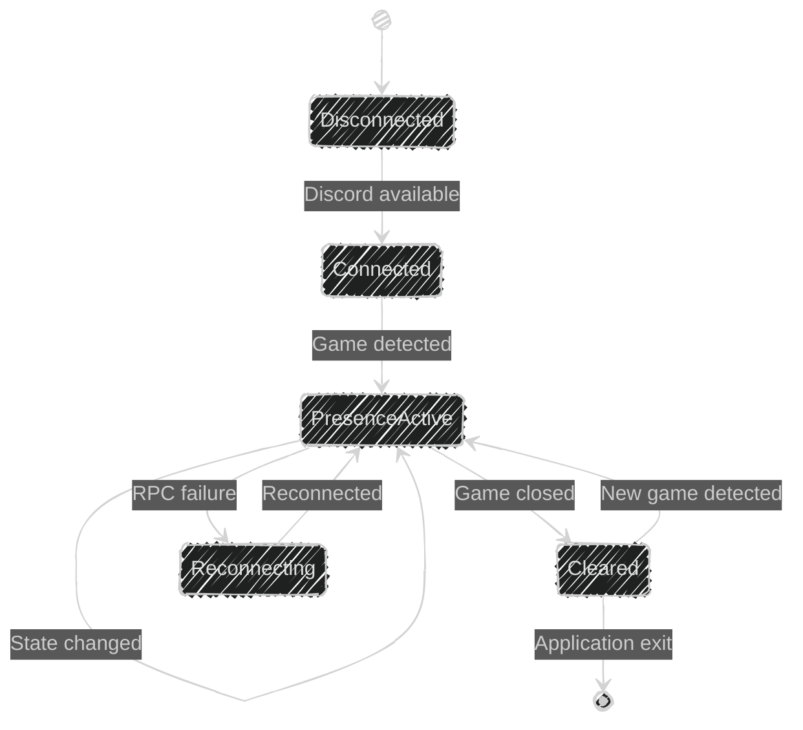
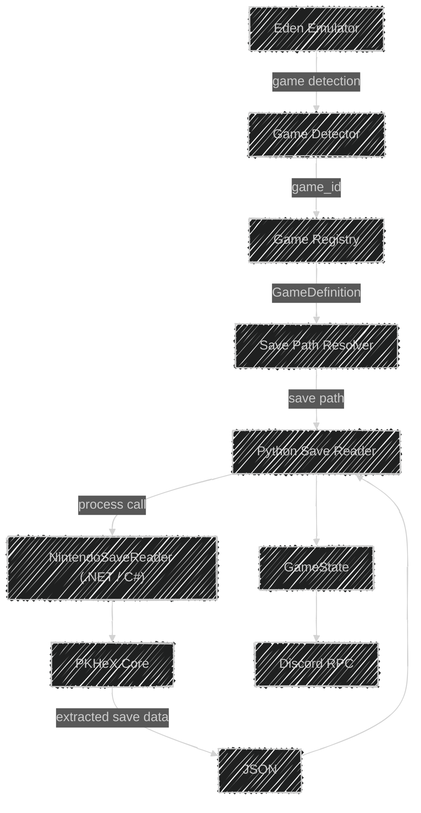
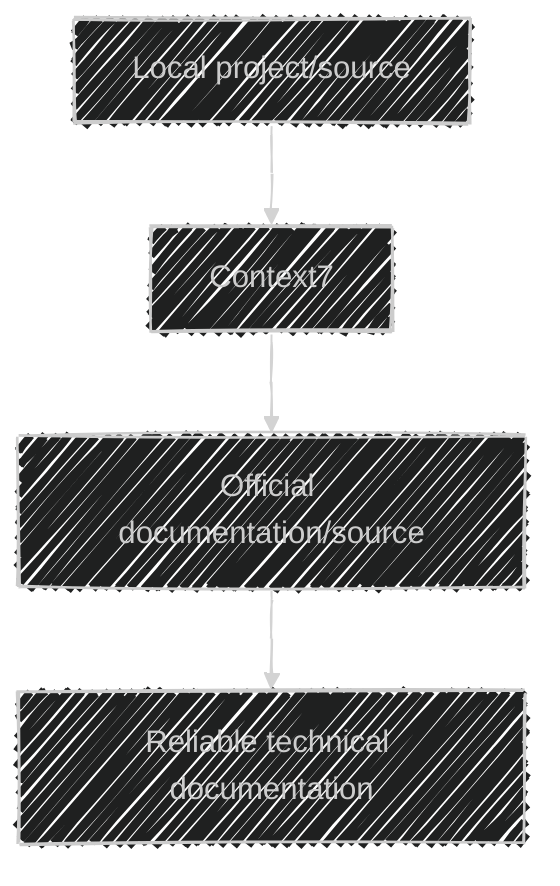

# Architecture

## Overview

SWITCH RPC is designed as a modular application with separate responsibilities for emulator detection, game configuration, save-data reading, application state, and Discord Rich Presence.

The main application is written in Python, while Pokémon save parsing is handled by a small C#/.NET bridge that uses PKHeX.Core.

The architecture is intentionally split so that adding support for another Pokémon game does not require rewriting the core application.

---

## System Architecture



### High-Level Responsibilities

| Component | Responsibility |
|---|---|
| Eden | Runs the Pokémon game |
| Game Detector | Detects Eden and identifies the active Pokémon game |
| Game Registry | Provides configuration for supported games |
| Save Path Resolver | Locates the local save file for a game |
| Save Reader | Invokes the C# bridge and parses its JSON output |
| PokemonSaveReader | Loads and extracts save data through PKHeX.Core |
| PKHeX.Core | Provides Pokémon save-format implementations |
| GameState | Represents game data in a common Python structure |
| Discord RPC | Sends the current state to Discord |

---

## Runtime/Application Flow

The main application periodically checks the emulator and updates the Discord Rich Presence when the detected state changes.



The monitoring interval is configurable through `config.json`.

---

## 1. Eden Detection

Eden is detected by its Windows process.

The current detector looks for:

```text
eden.exe
```

Once the process is found, the detector enumerates its visible windows and checks the window title to identify the running Pokémon game.

Example Eden window title:

```text
Eden | v0.2.1 | Clang 22.1.4 | Pokémon Scarlet (64-bit) | 3.0.1 | Nvidia
```

The detector maps known game names to internal game IDs.

For example:

```text
Pokémon Legends: Arceus → pokemon_legends_arceus
Pokémon Scarlet         → pokemon_scarlet
Pokémon Violet          → pokemon_violet
Pokémon Legends: Z-A    → pokemon_legends_za
```

### Responsibility

The detector should only answer questions related to:

- Is Eden running?
- What Pokémon game is currently running?

It should not:

- Parse save files.
- Communicate with Discord.
- Store game state.
- Contain game-specific save structures.

---

## 2. Game Registry

The `GameRegistry` loads game definitions from `config.json`.

Each game definition contains information such as:

```text
Game ID
Display name
Region
Discord artwork
Artwork tooltip
```

Example:

```json
{
	"pokemon_scarlet": {
		"name": "Pokémon Scarlet",
		"region": "Paldea",
		"large_image": "scarlet",
		"large_text": "Pokémon Scarlet"
	}
}
```

The registry allows the rest of the application to work with a common `GameDefinition` instead of hardcoding display information throughout the application.

### Responsibility

The registry should:

- Load game configuration.
- Provide a game definition by ID.
- Provide the list of configured games.

It should not:

- Detect processes.
- Read saves.
- Communicate with Discord.

---

## 3. Save Path Resolver

The `EdenSavePathResolver` determines where the save file for a detected game is stored.

The resolver currently uses Eden's local save directory and known game title IDs.

Conceptually:


The resolver is responsible only for locating the save file.

It should not parse the contents of the save.

### Important Rule

Do not hardcode user-specific paths.

Use dynamic paths such as:

```python
Path.home()
```

and configuration or known identifiers where appropriate.

---

## 4. Save Reader

The Python `SaveReader` acts as the interface between the Python application and the C# bridge.

Its responsibilities are:

1. Validate that the save exists.
2. Execute the C# save reader.
3. Pass the save path to the bridge.
4. Capture stdout and stderr.
5. Parse successful JSON output.
6. Handle bridge failures and invalid output.

The Python layer should not manually parse Pokémon save binary structures when PKHeX.Core already provides the required functionality.

---

## 5. Python → C# Bridge

The bridge is located at:

```text
bridge/PokemonSaveReader/
```

The Python application invokes the .NET executable and passes the save path as an argument.



The bridge is intentionally kept small.

It should not contain:

- Discord RPC logic.
- Eden detection.
- Python-specific application state.
- UI logic.

Its purpose is to provide a reliable boundary around PKHeX.Core.

---

## 6. PKHeX.Core

PKHeX.Core provides the save-format implementations used by the bridge.

The current bridge supports:

```text
SAV8LA
└── Pokémon Legends: Arceus

SAV9SV
└── Pokémon Scarlet / Violet
```

The bridge uses PKHeX save detection rather than manually identifying save formats from file size or guessed binary structures.

For example:

```csharp
SaveFile? save = SaveUtil.GetSaveFile(savePath);
```

The resulting save type is then handled by the appropriate reader.

---

## 7. Game-Specific Save Reading

Different Pokémon games use different save structures.

The bridge dispatches supported save types to game-specific reading logic.

Conceptually:

```text
SaveFile
   │
   ├── SAV8LA ──► ReadArceus()
   │
   └── SAV9SV ──► ReadScarletViolet()
```

This keeps game-specific knowledge isolated.

When a new game is added, its save-reading implementation should be introduced without coupling it to unrelated games.

### Save Structure Rule

Save structures must never be guessed.

Use:

- Verified PKHeX implementations.
- Local PKHeX source for the exact version being used.
- Context7 when relevant documentation is available.
- Official or reliable technical documentation.

If a save structure cannot be verified, leave the feature unimplemented rather than inventing offsets or fields.

---

## 8. JSON Data Boundary

The C# bridge returns structured JSON to Python.

Example:

```json
{
	"success": true,
	"game": {
		"version": "SL",
		"generation": 9,
		"type": "scarlet_violet"
	},
	"trainer": {
		"name": "Trainer",
		"id": 123456789
	},
	"playtime": {
		"hours": 10,
		"minutes": 51,
		"seconds": 28
	},
	"pokedex": {
		"seen": 41,
		"caught": 25,
		"total": 1025
	}
}
```

JSON acts as the boundary between the C# save parser and the Python application.

This prevents PKHeX-specific objects from leaking into the rest of the Python application.

---

## 9. GameState

`GameState` provides a common representation of information used by the Python application.

Current structure:

```python
@dataclass
class GameState:
	game_id: str
	playtime_seconds: int | None = None
	pokedex_caught: int | None = None
	pokedex_total: int | None = None
	location: str | None = None
```

The purpose of `GameState` is to decouple the rest of the application from individual save formats.

The intended flow is:


The Discord layer should consume application state rather than PKHeX objects.

---

## 10. Discord RPC

Discord Rich Presence is handled by:

```text
rpc/discord_rpc.py
```

The `DiscordRPC` class wraps PyPresence and manages:

- Connecting to Discord.
- Updating the Rich Presence.
- Clearing the Rich Presence.
- Closing the RPC connection.
- Handling connection failures.
- Reconnecting when necessary.

The rest of the application should interact with this wrapper rather than directly calling PyPresence.

### RPC Lifecycle



---

## Component Responsibilities

### `main.py`

Coordinates the application.

Responsible for:

- Loading configuration.
- Creating application components.
- Monitoring Eden.
- Detecting game changes.
- Reading game data.
- Building state.
- Updating Discord.
- Cleaning up on exit.

`main.py` should coordinate components rather than implement their internal behavior.

---

### `games/detector.py`

Responsible for Eden process and game detection.

Does not parse saves or communicate with Discord.

---

### `games/base.py`

Defines shared game configuration structures such as `GameDefinition`.

---

### `games/registry.py`

Loads and provides game definitions.

---

### `games/state.py`

Defines the common `GameState` structure.

---

### `games/save_paths.py`

Resolves the local save location for a game.

---

### `games/save_reader.py`

Runs the C# bridge and converts its JSON output into Python data.

---

### `games/game_save_reader.py`

Coordinates:

```text
Game ID
   ↓
Save Path Resolver
   ↓
Save Reader
```

This provides a higher-level interface for reading a game's save data.

---

### `rpc/discord_rpc.py`

Encapsulates Discord Rich Presence communication.

---

### `bridge/PokemonSaveReader/`

Contains the C# executable responsible for interacting with PKHeX.Core.

---

## Data Flow

A typical save-data update follows this flow:



---

## Game Extension Architecture

A new game should be added incrementally.

```text
New Game
   │
   ├── Game Definition
   │
   ├── Detection
   │
   ├── Save Path
   │
   ├── Save Reader
   │
   ├── GameState Mapping
   │
   ├── Discord Presentation
   │
   └── Tests
```

The core application should remain unchanged whenever possible.

For example, adding Pokémon Violet should primarily involve:

1. Adding or confirming its game definition.
2. Adding its save title ID.
3. Supporting its save format.
4. Mapping its save data into `GameState`.
5. Adding tests.
6. Updating documentation.

---

## Error Handling

Each layer should handle failures appropriate to its responsibility.

```text
Eden not running
      ↓
No active game
      ↓
Clear / keep Discord state appropriate
```

```text
Save not found
      ↓
Save reader returns failure
      ↓
Application continues monitoring
```

```text
Unsupported save
      ↓
Bridge returns failure
      ↓
Application continues monitoring
```

```text
Discord disconnected
      ↓
RPC wrapper detects failure
      ↓
Reconnect on a future update
```

The application should not terminate merely because an external dependency temporarily fails.

---

## Design Principles

### Separation of Concerns

Each component should have one primary responsibility.

### Read-Only by Design

Save files are data sources, not application state that the project modifies.

### Verified Data

Pokémon save structures must be based on verifiable implementations or documentation.

### Game Independence

Game-specific logic should not leak into unrelated game implementations.

### Stable Interfaces

Communication between major components should use stable, simple interfaces.

### Local Processing

Save data should be processed locally and should not be uploaded to external services.

### Graceful Failure

External failures should not unnecessarily terminate the monitoring application.

### Minimal Dependencies

Prefer existing dependencies and the standard library before introducing additional packages.

---

## Documentation and Research

When implementation depends on an external library, framework, SDK, or API, use **Context7** to retrieve current and relevant documentation when available.

The general research order is:



Always verify documentation against the actual dependency version used by the project.

For PKHeX specifically, the local PKHeX source corresponding to the version being built is authoritative for the actual API available to the bridge.

Never rely solely on model memory for version-sensitive APIs.

---

## Related Documentation

- [Development Setup](DEVELOPMENT.md)
- [Save Reader](SAVE-READER.md)
- [Game Support](GAME-SUPPORT.md)
- [Configuration](CONFIGURATION.md)
- [Discord RPC](DISCORD-RPC.md)
- [Troubleshooting](TROUBLESHOOTING.md)
- [Roadmap](ROADMAP.md)
