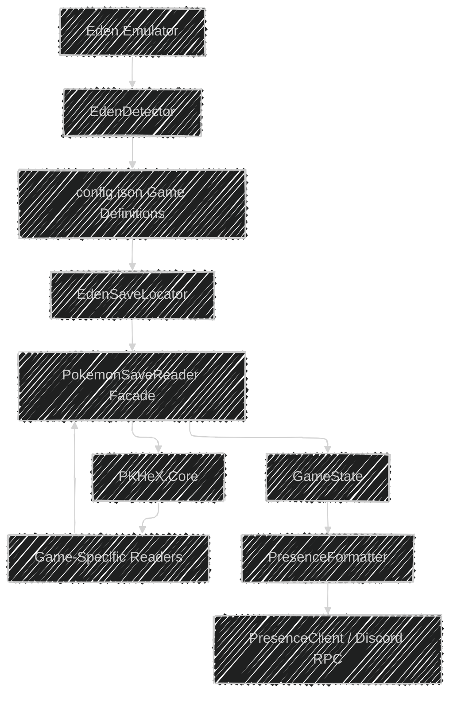
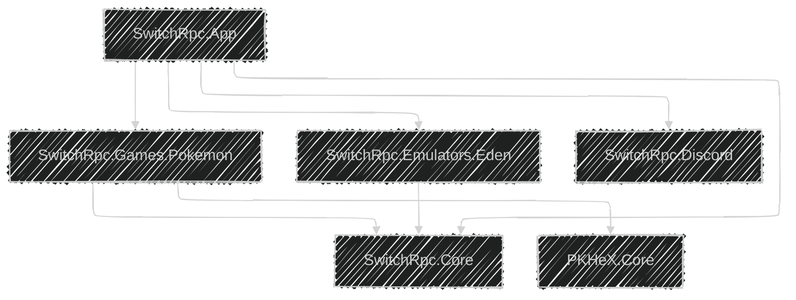
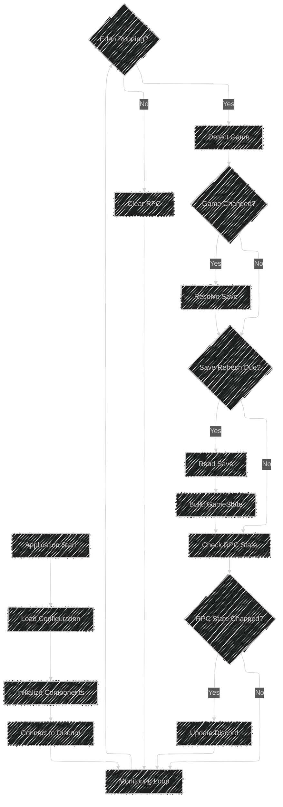
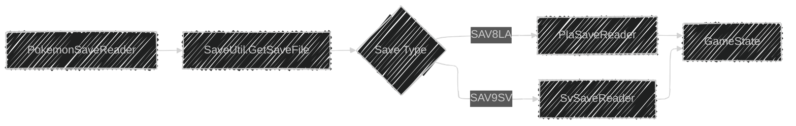
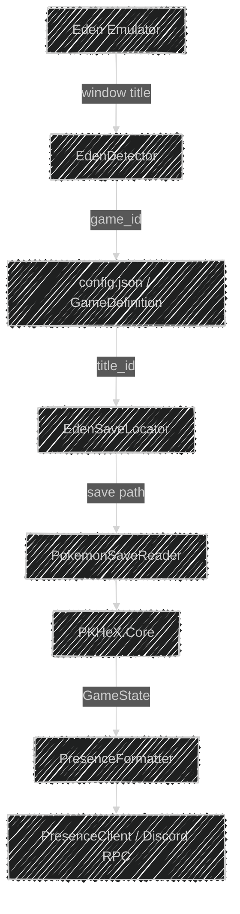
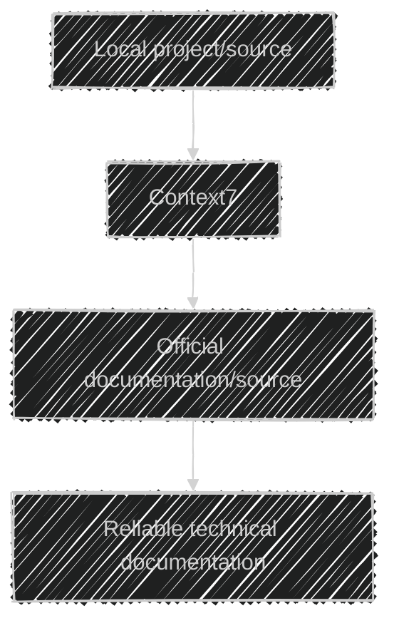

# Architecture

## Overview

SWITCH RPC is designed as a modular application with separate responsibilities for emulator detection, game configuration, save-data reading, application state, and Discord Rich Presence.

The application is a native .NET 10 console program. Pokémon save parsing is handled directly through PKHeX.Core — there is no subprocess or serialization boundary between the application and the save parser.

The architecture is intentionally split so that adding support for another Pokémon game does not require rewriting the core application.

---

## System Architecture



### High-Level Responsibilities

| Component | Responsibility |
|---|---|
| Eden | Runs the Pokémon game |
| EdenDetector | Detects Eden and identifies the active game from the window title |
| Game Definitions | Provide configured game metadata (`config.json`) |
| EdenSaveLocator | Locates the local save file for a game |
| PokemonSaveReader | Loads saves through PKHeX.Core and dispatches to game-specific readers |
| PKHeX.Core | Provides Pokémon save-format implementations |
| GameState | Represents game data in a common, dependency-free structure |
| PresenceFormatter | Shapes `GameState` into Discord presence strings |
| PresenceClient | Sends the current state to Discord |

---

## Solution Structure

The solution file is `SwitchRpc.slnx` (the .NET 10 solution format). All application code lives under `src/`, tests under `tests/`.

| Project | Responsibility | References |
|---|---|---|
| `SwitchRpc.Core` | Normalized `GameState`, `GameDefinition`, presence formatting | nothing |
| `SwitchRpc.Games.Pokemon` | PKHeX-based save readers behind a `PokemonSaveReader` facade | PKHeX.Core, Core |
| `SwitchRpc.Emulators.Eden` | Eden process/window detection, save location | Core |
| `SwitchRpc.Discord` | Discord Rich Presence wrapper | DiscordRichPresence |
| `SwitchRpc.App` | Console host, monitoring loop, configuration, diagnostics | all of the above |



Rules enforced by the project split:

- `SwitchRpc.Core` references nothing — PKHeX, Discord, and Eden types cannot leak into the normalized state.
- Only `SwitchRpc.Games.Pokemon` touches PKHeX.Core, through the `PokemonSaveReader` facade.
- Only `SwitchRpc.Discord` touches the Discord library.
- Game definitions come from `config.json` at runtime; display names, regions, title IDs, and artwork are configuration, not code.

Tests live in `tests/SwitchRpc.Tests` (xUnit); run them with `dotnet test SwitchRpc.slnx`. Benchmark evidence for the migration from the retired Python baseline is recorded in `docs/BENCHMARKS.md`.

---

## Runtime/Application Flow

The main application periodically checks the emulator and updates the Discord Rich Presence when the detected state changes.



The monitoring interval is configurable through `config.json`. The loop catches per-tick exceptions and keeps polling; programming errors resurface every tick instead of being hidden.

---

## 1. Eden Detection

Eden is detected by its Windows process.

The detector looks for:

```text
eden.exe
```

Once the process is found, the detector enumerates its visible windows and checks the window title against the display names configured in `config.json`.

Example Eden window title:

```text
Eden | v0.2.1 | Clang 22.1.4 | Pokémon Scarlet (64-bit) | 3.0.1 | Nvidia
```

The detector reports the configured game ID, for example:

```text
Pokémon Legends: Arceus → pokemon_legends_arceus
Pokémon Scarlet         → pokemon_scarlet
Pokémon Violet          → pokemon_violet
Pokémon Legends: Z-A    → pokemon_legends_za
```

`EdenDetector.Poll` performs a single process scan per tick and logs state transitions (Eden started/stopped, game changed).

### Responsibility

The detector should only answer questions related to:

- Is Eden running?
- What game is currently running?

It should not:

- Parse save files.
- Communicate with Discord.
- Store game state.
- Contain game-specific save structures.

---

## 2. Game Definitions

Game definitions are loaded from `config.json` into `GameDefinition` records at runtime.

Each game definition contains information such as:

```text
Game ID
Display name
Region
Title ID
Discord artwork
Artwork tooltip
```

Example:

```json
{
	"pokemon_scarlet": {
		"name": "Pokémon Scarlet",
		"region": "Paldea",
		"title_id": "0100A3D008C00000",
		"large_image": "scarlet",
		"large_text": "Pokémon Scarlet"
	}
}
```

Definitions allow the rest of the application to work with a common `GameDefinition` instead of hardcoding display information throughout the code.

### Responsibility

The configuration layer should:

- Load game definitions.
- Provide a game definition by ID.
- Provide the list of configured games.

It should not:

- Detect processes.
- Read saves.
- Communicate with Discord.

---

## 3. Save Path Resolution

The `EdenSaveLocator` determines where the save file for a detected game is stored.

The locator maps the game's configured title ID onto Eden's local save directory.

Conceptually:


The locator is responsible only for locating the save file.

It should not parse the contents of the save.

### Important Rule

Do not hardcode user-specific paths.

Use dynamic paths such as:

```csharp
Environment.GetFolderPath(Environment.SpecialFolder.UserProfile)
```

and configuration or known identifiers where appropriate.

---

## 4. Save Reader Facade

`PokemonSaveReader` (in `SwitchRpc.Games.Pokemon`) is the single entry point for save reading.

Its responsibilities are:

1. Load the save through PKHeX's own detection (`SaveUtil.GetSaveFile`).
2. Select the matching `ISaveStateReader` for the identified save type.
3. Return a normalized `SaveReadResult` — either a `GameState`, or an explicit unsupported/unidentifiable result.



Unsupported formats are reported through `SaveReadResult` (`Supported = false`, with the identified save type name) so the host can degrade to identity-only presence instead of failing.

The facade should not:

- Modify the input save.
- Leak PKHeX types to callers.
- Contain Discord RPC logic.
- Depend on the application host.

---

## 5. PKHeX.Core

PKHeX.Core provides the save-format implementations used by the readers. It is consumed as a local source checkout under `bridge/PKHeX/` (untracked) through a `ProjectReference`.

Currently supported save types:

```text
SAV8LA
└── Pokémon Legends: Arceus

SAV9SV
└── Pokémon Scarlet / Violet
```

The readers use PKHeX save detection rather than manually identifying save formats from file size or guessed binary structures.

For example:

```csharp
SaveFile? save = SaveUtil.GetSaveFile(savePath);
```

The resulting save type is then handled by the appropriate reader.

See [PKHeX.md](PKHeX.md) for the checkout layout, identification quirks, and API verification rules.

---

## 6. Game-Specific Save Reading

Different Pokémon games use different save structures.

Each supported save type has its own `ISaveStateReader` implementation (`CanRead` + `Read`) inside `SwitchRpc.Games.Pokemon`.

Conceptually:

```text
SaveFile
   │
   ├── SAV8LA ──► PlaSaveReader
   │
   └── SAV9SV ──► SvSaveReader
```

This keeps game-specific knowledge isolated.

When a new game is added, its save-reading implementation should be introduced without coupling it to unrelated games.

### Save Structure Rule

Save structures must never be guessed.

Use:

- Verified PKHeX implementations.
- Local PKHeX source for the exact version being used.
- Context7 when relevant documentation is available.
- Official or reliable technical documentation.

If a save structure cannot be verified, leave the feature unimplemented rather than inventing offsets or fields.

---

## 7. GameState

`GameState` (in `SwitchRpc.Core`) provides a common representation of information used by the presentation layer.

Current structure:

```csharp
public sealed record GameState(
	string GameId,
	long? PlaytimeSeconds,
	string? LocationName,
	int? LocationId,
	IReadOnlyDictionary<string, DexStats> Pokedex
);
```

The purpose of `GameState` is to decouple the rest of the application from individual save formats.

The intended flow is:


The Discord layer should consume application state rather than PKHeX objects. PKHeX types never cross the `GameState` boundary.

---

## 8. Discord RPC

Discord Rich Presence is handled by:

```text
src/SwitchRpc.Discord/PresenceClient.cs
```

The `PresenceClient` class wraps the DiscordRichPresence library and manages:

- Connecting to Discord.
- Tracking connection state through the client lifecycle events (`OnReady`, `OnClose`, `OnConnectionFailed`, `OnError`).
- Updating the Rich Presence.
- Clearing the Rich Presence.
- Disposing and reinitializing the client (the library keeps its initialized flag after the pipe dies, so reconnection calls `Deinitialize()` before `Initialize()` again).
- Preserving the session timer across reconnections.

The rest of the application should interact with this wrapper rather than directly calling the Discord library.

### RPC Lifecycle


---

## Component Responsibilities

### `src/SwitchRpc.App/`

Console host and monitoring loop.

- `Program.cs` — entry point, component wiring, shutdown.
- `AppLoop.cs` — the monitoring loop: poll Eden, detect game changes, refresh saves, update Discord.
- `ConfigLocator.cs` — locates and loads `config.json`.
- `Diagnose.cs` — `--diagnose` mode: runs the pipeline once and prints metrics.

### `src/SwitchRpc.Core/`

Dependency-free normalized state.

- `GameDefinition.cs` — configured game metadata.
- `GameState.cs` — the normalized state record and `DexStats`.
- `PresenceFormatter.cs` — shapes `GameState` into presence strings.

### `src/SwitchRpc.Emulators.Eden/`

- `EdenDetector.cs` — Eden process/window detection and game identification.
- `EdenSaveLocator.cs` — title ID → save path resolution.

### `src/SwitchRpc.Games.Pokemon/`

- `PokemonSaveReader.cs` — the facade over all Pokémon save reading.
- `ISaveStateReader.cs` — the reader contract (`CanRead` + `Read`).
- `SvSaveReader.cs` — Scarlet/Violet (SAV9SV).
- `PlaSaveReader.cs` — Legends: Arceus (SAV8LA).

### `src/SwitchRpc.Discord/`

- `PresenceClient.cs` — Discord Rich Presence communication and reconnection.

### `tests/SwitchRpc.Tests/`

xUnit tests covering the core state, presence formatting, save readers, and the Eden save locator.

---

## Data Flow

A typical save-data update follows this flow:



---

## Game Extension Architecture

A new game should be added incrementally.

```text
New Game
   │
   ├── Game Definition
   │
   ├── Detection
   │
   ├── Save Path
   │
   ├── Save Reader
   │
   ├── GameState Mapping
   │
   ├── Discord Presentation
   │
   └── Tests
```

The core application should remain unchanged whenever possible.

For example, adding Pokémon Violet should primarily involve:

1. Adding or confirming its game definition.
2. Adding its save title ID.
3. Supporting its save format.
4. Mapping its save data into `GameState`.
5. Adding tests.
6. Updating documentation.

---

## Error Handling

Each layer should handle failures appropriate to its responsibility.

```text
Eden not running
      ↓
No active game
      ↓
Clear / keep Discord state appropriate
```

```text
Save not found
      ↓
Save reader returns failure
      ↓
Application continues monitoring
```

```text
Unsupported save
      ↓
Reader reports Supported = false
      ↓
Application degrades to identity-only presence
```

```text
Discord disconnected
      ↓
PresenceClient detects failure
      ↓
Reinitialize and reconnect on a future update
```

The application should not terminate merely because an external dependency temporarily fails.

---

## Design Principles

### Separation of Concerns

Each component should have one primary responsibility.

### Read-Only by Design

Save files are data sources, not application state that the project modifies.

### Verified Data

Pokémon save structures must be based on verifiable implementations or documentation.

### Game Independence

Game-specific logic should not leak into unrelated game implementations.

### Stable Interfaces

Communication between major components should use stable, simple interfaces.

### Local Processing

Save data should be processed locally and should not be uploaded to external services.

### Graceful Failure

External failures should not unnecessarily terminate the monitoring application.

### Minimal Dependencies

Prefer existing dependencies and the base class library before introducing additional packages.

---

## Documentation and Research

When implementation depends on an external library, framework, SDK, or API, use **Context7** to retrieve current and relevant documentation when available.

The general research order is:



Always verify documentation against the actual dependency version used by the project.

For PKHeX specifically, the local PKHeX source corresponding to the version being built is authoritative for the actual API available to the readers.

Never rely solely on model memory for version-sensitive APIs.

---

## Related Documentation

- [Development Setup](DEVELOPMENT.md)
- [Save Reader](SAVE-READER.md)
- [Game Support](GAME-SUPPORT.md)
- [Configuration](CONFIGURATION.md)
- [Discord RPC](DISCORD-RPC.md)
- [Troubleshooting](TROUBLESHOOTING.md)
- [Roadmap](ROADMAP.md)
