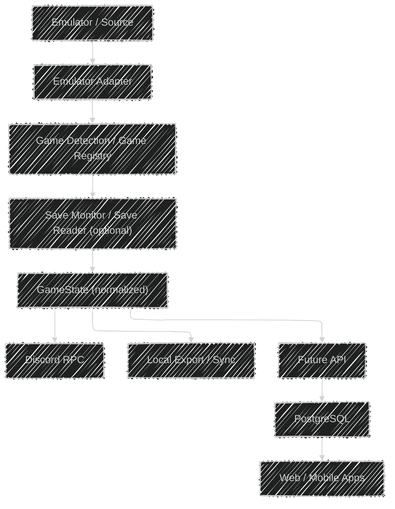

# ROADMAP.md

Development roadmap for **SWITCH RPC**.

SWITCH RPC is a modular, read-only Discord Rich Presence platform for
Nintendo Switch games running through emulators. Its first fully
implemented target is Pokémon games running through the Eden emulator,
with save data parsed through PKHeX.Core.

The project is evolving from a Pokémon-specific application into a
generic Switch gaming platform. This document describes the phases of
that evolution and the principles that govern it.

------------------------------------------------------------------------

## 1. Target Architecture

The long-term architecture is adapter-based and game-agnostic:

This is the **target** architecture, not the current implementation.
Today's runtime flow (Eden detection → save location → PKHeX.Core save
reading → GameState → Discord RPC) is the .NET implementation
described in Phase 2 below.

### Core Architectural Principles

1. Core logic must not depend on Discord, a web application, or a database.
2. Emulator-specific behavior is isolated behind adapters.
3. Game-specific behavior is isolated behind game definitions and readers.
4. Pokémon and PKHeX are one implementation, never the universal save system.
5. GameState is the normalized boundary between readers and consumers.
6. Future API/web/mobile clients consume normalized data, never raw saves.
7. New games and emulators must be addable without rewriting the core.
8. Avoid premature abstraction — build boundaries only when they are real.
9. Save access is read-only, always.

------------------------------------------------------------------------

## 2. Status Legend

| Symbol | Meaning |
|---|---|
| ✅ | Implemented and verified |
| 🔄 | In progress |
| ⏳ | Planned — not started |
| 🚫 | Unsupported until verified |

------------------------------------------------------------------------

## 3. Phase 0 — Python Baseline Stabilization ✅

Complete. The Python implementation was stabilized and tagged as
`v0.1.0-python-baseline`: green validation gates (`python dev.py all`),
layered documentation, and verified save readers for Legends: Arceus and
Scarlet.

**Implemented and verified:**

- Eden process and window detection.
- Pokémon game detection: Legends: Arceus and Scarlet verified; Violet
  and Legends: Z-A configured but unverified.
- Save path resolution for supported titles.
- PKHeX.Core save reading through the C# bridge: trainer, playtime,
  Pokédex, party, boxes, and location data.
- Normalized `GameState` model.
- Discord Rich Presence with session timer and Pokédex rotation.
- Developer CLI (`dev.py`), Ruff, Pyright, and pytest with a fully
  green validation gate (`python dev.py all`).
- Documentation suite.

The baseline was retired in Phase 2 in favor of the native .NET
implementation; its history is preserved under the
`v0.1.0-python-baseline` tag. Carry-over work (dynamic RPC
integration, Pokédex accuracy, broader real-save coverage) is tracked
under the current focus below and in `TODO.md`.

**Adjacent (optional) work:** standalone packaging (single-file
executable) and a cleaner logging architecture.

------------------------------------------------------------------------

## 4. Planned Phases

### Phase 1 — .NET 10 Architecture POC ✅

Complete. The POC validated the architecture on the
`experiment/dotnet-core` branch: a native pipeline (Eden detection, save
reading through PKHeX.Core directly, normalized GameState, Discord RPC)
produced identical results to the Python baseline on the same saves, and
the benchmark favored the native approach — ~3.4–4.9× faster save
refresh, lower idle CPU, no subprocess bridge, one runtime instead of
two. Evidence: `docs/BENCHMARKS.md`.

### Phase 2 — Migrate RPC Core to .NET 10 ✅

Complete and merged to `main` (`08d9de6`). The POC was promoted into a
layered `SwitchRpc.*` solution under `src/` with config-driven game
definitions, presence reconnection hardening, a passing xUnit suite,
and live validation on real saves. The Python baseline and the JSON
bridge were then retired; the repository is now .NET-only and their
history is preserved under the `v0.1.0-python-baseline` tag.

Follow-up work tracked in `TODO.md`: CI checks, single-file packaging,
and broader real-save regression coverage (Violet, Legends: Z-A). An
optional `v0.2.0-dotnet-core` tag follows live validation on `main`.

### Phase 3 — Universal Emulator Architecture ⏳

Introduce an emulator adapter abstraction covering process and window
detection, running-game identification, installation metadata, and
save locations. Implemented first as `EdenAdapter`, then proven with at
least one additional emulator before broad expansion.

### Phase 4 — Universal Game Architecture ⏳

A generic game definition and registry: identity, title IDs,
capabilities, RPC metadata, and save-reader availability. Pokémon
becomes one implementation; other games require no Pokémon-specific
code. Groundwork: centralizing today's detection rules into
`GameDefinition` is tracked in `TODO.md`.

### Phase 5 — Universal Save Architecture ⏳

Separate save concerns: **SaveSource** (where the save comes from),
**SaveMonitor** (when it changes), and **SaveReader** (how it is
parsed), producing a normalized GameState. The system handles locked
files, temporary files, invalid saves, partial writes, and unsupported
versions — read-only, always.

### Phase 6 — Pokémon + PKHeX Integration ⏳

Make Pokémon support a mature implementation of the universal save
architecture: trainer, playtime, location, Pokédex, party, boxes,
metadata, and progression for Legends: Arceus, Scarlet, Violet, and
Legends: Z-A. Each game is verified against real saves before being
marked supported. PLA and SV have different save structures and are not
forced into identical internal models.

### Phase 7 — Universal SWITCH RPC ⏳

RPC is no longer Pokémon-specific. Games with a save reader expose rich
state; games without one still expose game identity, emulator, and
session information. RPC degrades gracefully and updates only on
meaningful change.

### Phase 8 — Local Save Platform ⏳

A local-first data layer: save snapshots and normalized state cached in
SQLite, starting with Pokémon.

### Phase 9 — Data API + PostgreSQL ⏳

An ASP.NET Core API exposing normalized game data, backed by
PostgreSQL and fed by a local sync engine. The web application never
touches the database directly.

### Phase 10 — Web Application ⏳

A separate web client consuming the API: dashboard, game collection,
Pokédex, boxes, party, and save history. Designed only after the API
contract stabilizes.

### Phase 11 — Multi-Game Expansion ⏳

Expand beyond Pokémon based on technical feasibility, available save
parsers, usefulness, and maintainability. Not every game will have a
save parser.

### Phase 12 — Desktop / Mobile Clients ⏳

Windows desktop and Android clients, with technology decisions made
when the state of the ecosystem is known.

### Phase 13 — Open-Source Ecosystem ⏳

Contributor documentation, plugin systems for game and emulator
adapters, API documentation, and developer SDKs. A future repository
split (`switch-game-core`, `switch-rpc`, `switch-save-api`,
`switch-save-web`) happens **only after the architecture stabilizes and
only as an explicit decision.**

------------------------------------------------------------------------

## 5. Current Focus

Near-term work, following the Phase 2 merge:

- Live validation of the .NET application on `main`, then the optional
  `v0.2.0-dotnet-core` tag.
- Dynamic RPC integration for the expanded GameState (location, party)
  without unnecessary updates.
- Game-specific Pokédex accuracy (regional, DLC, totals) verified
  against known saves.
- Pokémon Violet verification to reach parity with Scarlet.
- Automated test expansion (real-save regression coverage, Eden
  start/stop behavior).
- Runtime loop optimization and cleaner logging.
- Extending `GameDefinition` with game-specific capabilities as
  groundwork for Phases 3–4.

------------------------------------------------------------------------

## 6. Guiding Principles

1. **Read-only access.** The application never modifies, writes to, or
   injects data into save files.
2. **No guesswork.** Save offsets and structures must be verified
   against PKHeX implementations or reliable documentation; unknown
   structures stay unimplemented.
3. **No embedded PKHeX source.** PKHeX is an external dependency; its
   source tree is never tracked in this repository.
4. **Honest status.** Planned functionality is never documented as
   implemented; detection alone is never claimed as support.
5. **Architectural purity.** Correctness and save-data safety outrank
   convenience; abstractions exist only at real boundaries.
