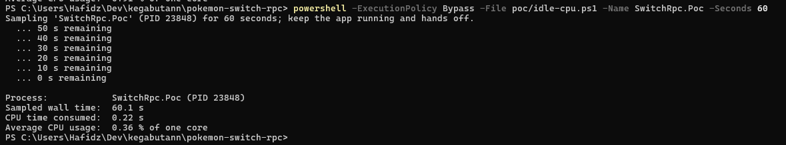
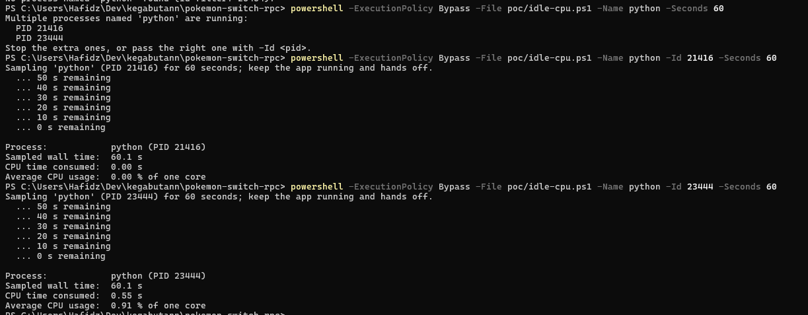
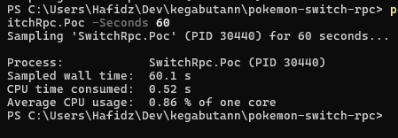
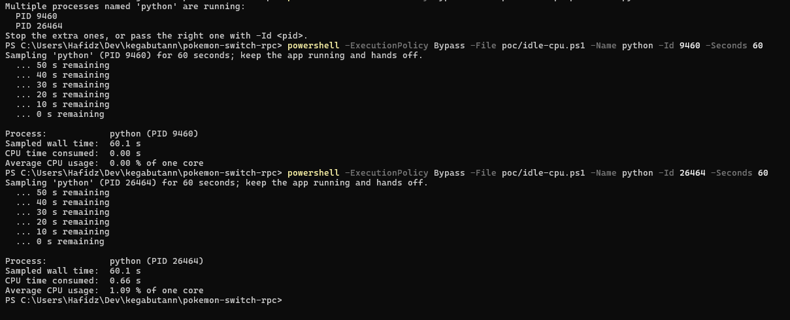
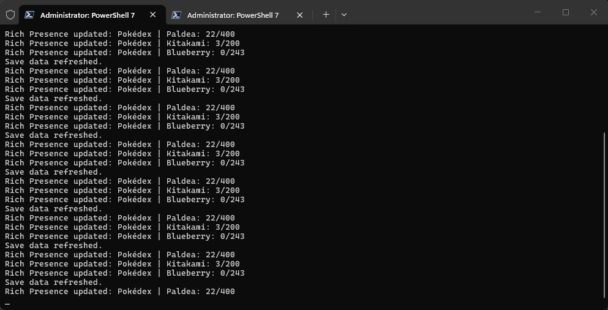

# Phase 1 Benchmark — Python Baseline vs .NET 10 POC

Phase 1 of `docs/ROADMAP.md` exists to validate whether a .NET-native
architecture is better suited for the long term before the project
commits to migration. This file records the benchmark plan, measured
results, and how to reproduce them.

## Cross-validation

Before timing anything, both implementations were pointed at the same
real Scarlet save. They produce identical normalized results:

| Field | Python baseline | .NET POC |
|---|---|---|
| game_id | `pokemon_scarlet` | `pokemon_scarlet` |
| playtime_seconds | 39088 | 39088 |
| location | Artazon (id 86) | Artazon (id 86) |
| Pokédex paldea | 33 seen / 22 caught | 33 seen / 22 caught |
| Pokédex kitakami | 8 seen / 3 caught | 8 seen / 3 caught |
| Pokédex blueberry | 0 seen / 0 caught | 0 seen / 0 caught |

The Legends: Arceus save cross-validates identically as well:

| Field | Python baseline | .NET POC |
|---|---|---|
| game_id | `pokemon_legends_arceus` | `pokemon_legends_arceus` |
| playtime_seconds | 24634 | 24634 |
| Pokédex hisui | 8 seen / 8 caught / 242 total | 8 seen / 8 caught / 242 total |

## Measured results

2026-09-20, Windows 11. .NET numbers are Release-build medians of 3
runs; Python numbers are medians of 3 runs.

| Metric | Python baseline | .NET 10 POC (Release) |
|---|---|---|
| Import / startup | 240 ms (median; 221–324) | not yet measured |
| Working set after load | 29.3 MiB | 25.3 MiB |
| Save refresh, Scarlet | 429 ms (median; 426–539) | ~88 ms |
| Save refresh, Legends: Arceus | 322 ms (median; 319–332) | ~95 ms |
| Threads | not yet measured | 8 |

.NET save-refresh components: Scarlet — PKHeX identification 34 ms +
parse 53 ms; PLA — identification 77 ms + parse 18 ms. Earlier
Debug-build single runs (~197 ms / ~119 ms) are consistent with these.

Caveats:

- The .NET save-refresh figure is PKHeX identification (97.6 ms) plus
  parse (98.6 ms) measured in-process; it does not include save-path
  location. The Python figure includes save-path location, spawning the
  .NET bridge as a subprocess, and JSON round-trip. That subprocess
  overhead is exactly what a native implementation removes — the
  architectural hypothesis under test.
- The .NET POC extracts a subset of save data (playtime, location,
  Pokédex) while the Python bridge also extracts party and boxes, so
  parse timings are indicative rather than strictly 1:1.
- Debug builds; single runs on the development machine. Re-measure with
  Release builds and repeated runs before drawing conclusions.

## How to reproduce

Python startup and full save-read path:

``` powershell
.venv/Scripts/python.exe -c "import time; t = time.perf_counter(); import main; print((time.perf_counter() - t) * 1000, 'ms')"
```

.NET POC diagnose (process metrics, detection, save metrics):

``` powershell
dotnet run --project poc/SwitchRpc.Poc --no-build -- --diagnose
```

## Idle CPU (measured live, 60 s samples)

2026-09-20, sampled with `poc/idle-cpu.ps1` (TotalProcessorTime over a
60 s window, reported as average % of one core; Task Manager-style
percentages look smaller because they divide across all cores).

| Scenario | Python baseline | .NET 10 POC |
|---|---|---|
| Eden closed (poll-only idle) | 0.91 % | 0.36 % |
| Eden running, Scarlet in-game | 1.09 % | 0.86 % |









Findings:

- With Eden closed, Python burns 0.91 % of a core doing nothing: the
  loop enumerates all system processes twice per second through
  `psutil.process_iter` (`is_running()` and `detect_game()` each run a
  full scan). This quantifies the "optimize the main application loop
  while Eden is not running" item in TODO.md — worth fixing in the
  Python baseline regardless of the migration decision.
- The POC idles at 0.36 % and spends its additional CPU on real work
  when Eden runs: window enumeration, save parsing every 15 s, and RPC
  updates every 5 s.
- The Python figures exclude the CPU of the dotnet bridge child process
  spawned on every save refresh; the POC has no child process, so its
  total system footprint is exactly what the table shows.

## Live-loop behaviour

Verified live on 2026-09-20 (Eden + Discord running, Scarlet save):



- Presence appears within 1 s of game detection; Pokédex pages rotate
  every 5 s (Paldea → Kitakami → Blueberry).
- Save data refreshes on the configured 15 s interval.
- Presence clears when the game window closes.
- Ctrl+C exits cleanly and clears presence; no unhandled exceptions.
